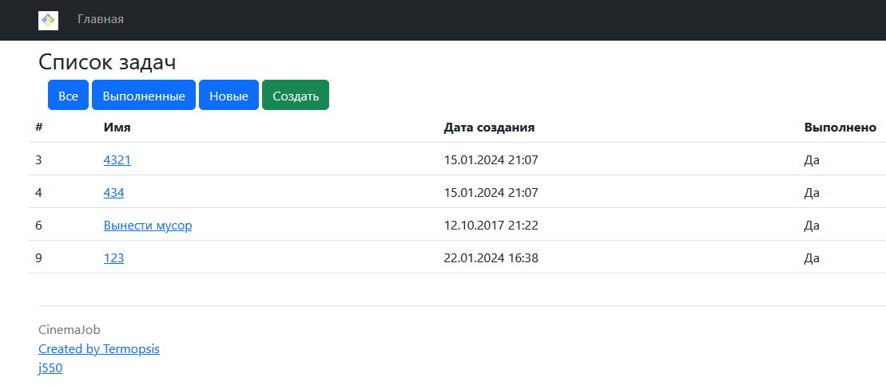
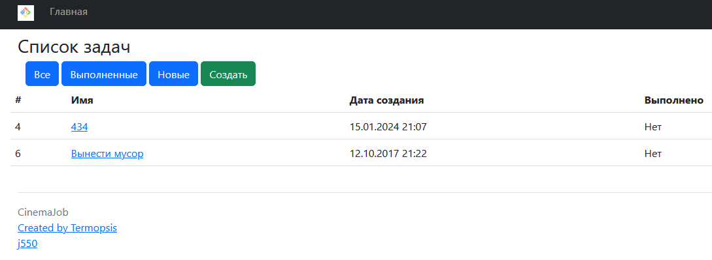
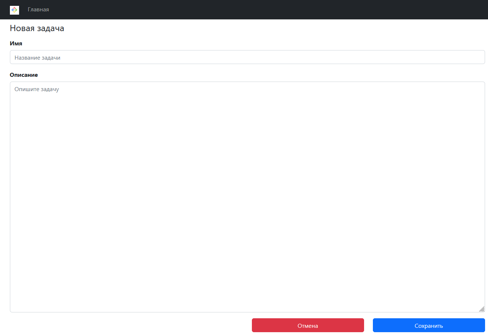
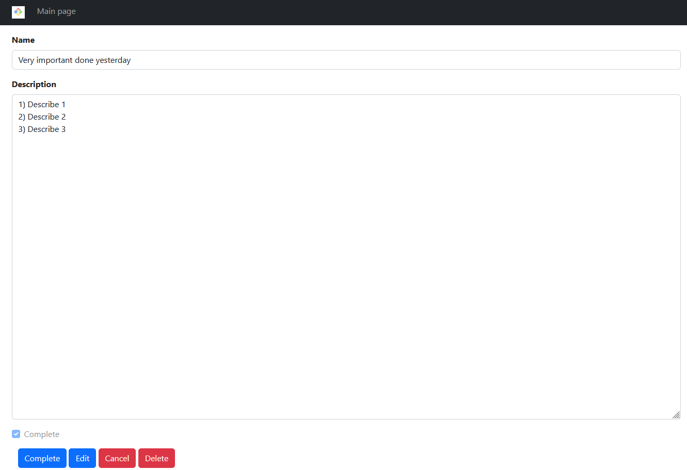

### Проект "Список дел" job4j_todo

### Web-приложение по ведению и контролю задач
    Доступные действия:
    1. Вывод всех заданий;
    2. Отображение списка заданий по одному статусу;
    3. Добавление/ редактирование заданий;

### Стек технологий
    Java 17
    Spring Boot 2.7.6
    Thymeleaf
    Bootstrap CSS
    Hibernate 5.6
    PostgreSQL 15.1 (драйвер JDBC 42.5.1)
    Checkstyle 10.0
    Liquibase 4.15.0

### Требование к окружению
    - Java 17
    - Maven 3.8
    - PostgreSQL 15

### Как запустить проект
   
### Взаимодействие с приложением

1) Главная страница WEB-приложения (По умолчанию отображает всё задачи):

2) Фильтр задач с помощью кнопок (Все, Выполненные, Новые)
- Все отображает все задачи - По умолчанию
- Выполненные - отображает задачи с признаком "Выполнено"

- Новые - отображает задачи которые еще не были выполнены

3) Создание новой задачи

4) Просмотр детального описания задачи - без возможности редактировать

5) Редакитрование задачи - доступно из формы просмотра детального описания

