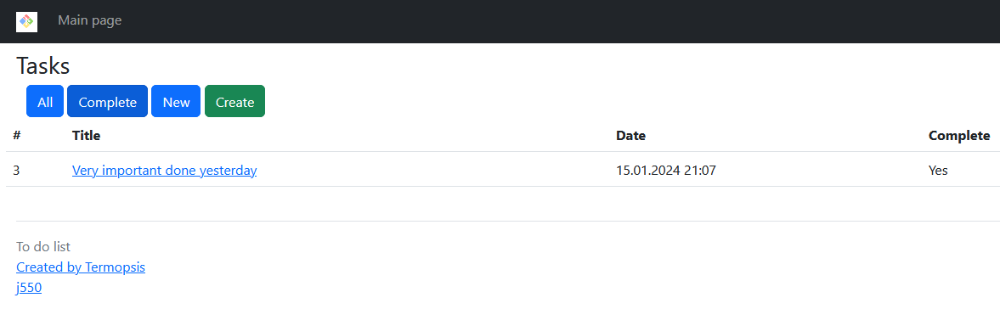
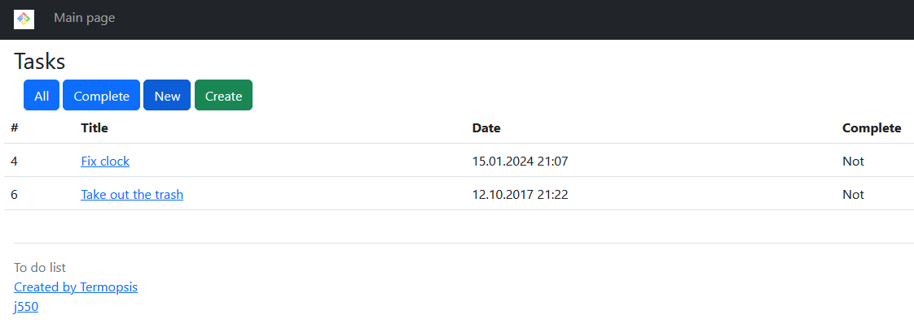

### To do list
A simple to do list to manage your tasks

### Main logic of the Web-app
* Display all / completed / new task
* Create / edit / remove task

### Used technologies
    Java 17
    Spring Boot 2.7.6
    Thymeleaf 3.0.15
    Hibernate 5.6
    PostgreSQL 12 (драйвер JDBC 42.5.1)
    Checkstyle 10.0
    Liquibase 4.15.0
    Lombok 1.18.22
    Checkstyle plugin 5.85.1

### Environment requirements
    - Java 17
    - Maven 3.8
    - PostgreSQL 12

### How to run the project
* Clone the project from this repo
* Create a local database "todo"
* Run liquibase:update to create and fill tables
* Launch the app through the Main class, located in folder src\main\java\ru\job4j\todo\Main
* Application access page localhost:8080
   
### App screenshots

1) Home page (Show all tasks by default):

2) Filter task by bottoms (All, Complete, New)
- Show all tasks by default
- Complete - Show tasks with sign Complete = true

- New - Show tasks with sign Complete = false

3) Create new task

4) View task description - no editing possible

5) Edit task - Can access through view description form

